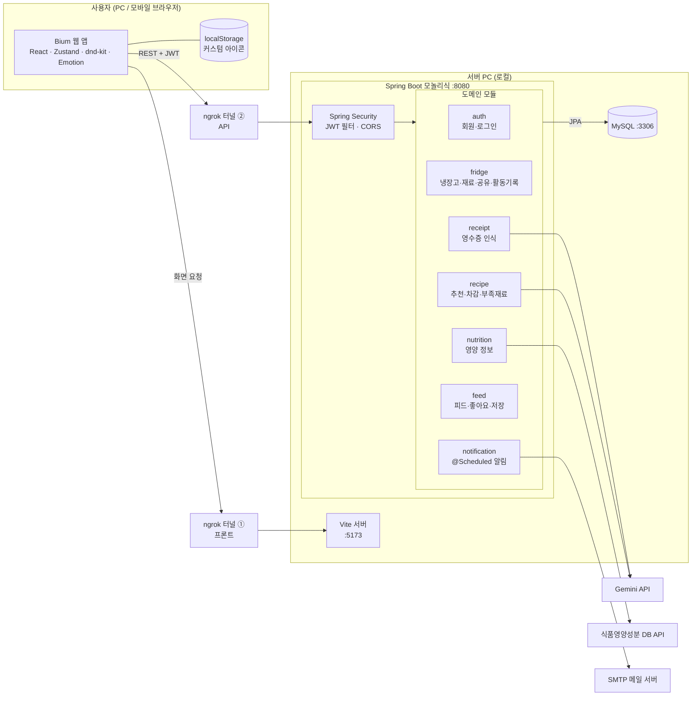

```mermaid
flowchart LR
    subgraph Client["사용자 (PC / 모바일 브라우저)"]
        APP["Bium 웹 앱<br/>React · Zustand · dnd-kit · Emotion"]
        LS[("localStorage<br/>커스텀 아이콘")]
        APP --- LS
    end

    NG1["ngrok 터널 ①<br/>프론트"]
    NG2["ngrok 터널 ②<br/>API"]

    subgraph Host["서버 PC (로컬)"]
        VITE["Vite 서버<br/>:5173"]

        subgraph Server["Spring Boot 모놀리식 :8080"]
            SEC["Spring Security<br/>JWT 필터 · CORS"]
            subgraph Modules["도메인 모듈"]
                AUTH["auth<br/>회원·로그인"]
                FRIDGE["fridge<br/>냉장고·재료·공유·활동기록"]
                RECEIPT["receipt<br/>영수증 인식"]
                RECIPE["recipe<br/>추천·차감·부족재료"]
                NUTRI["nutrition<br/>영양 정보"]
                FEED["feed<br/>피드·좋아요·저장"]
                NOTI["notification<br/>@Scheduled 알림"]
            end
            SEC --> Modules
        end

        DB[("MySQL :3306")]
    end

    GEM["Gemini API"]
    NUT["식품영양성분 DB API"]
    SMTP["SMTP 메일 서버"]

    APP -- "화면 요청" --> NG1 --> VITE
    APP -- "REST + JWT" --> NG2 --> SEC
    Modules -- "JPA" --> DB
    RECEIPT --> GEM
    RECIPE --> GEM
    NUTRI --> NUT
    NOTI --> SMTP
```
